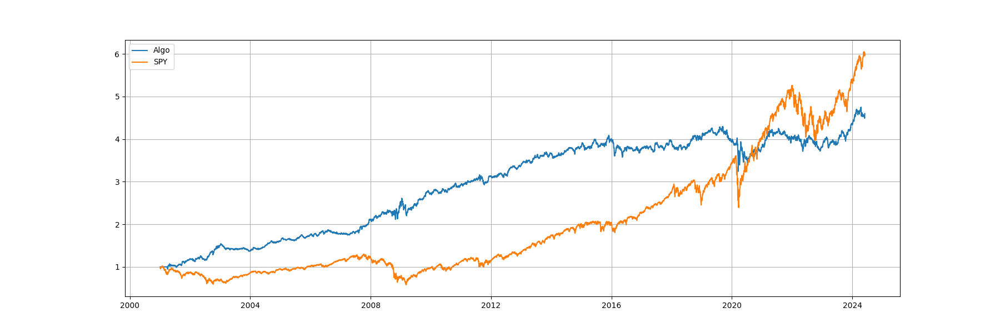
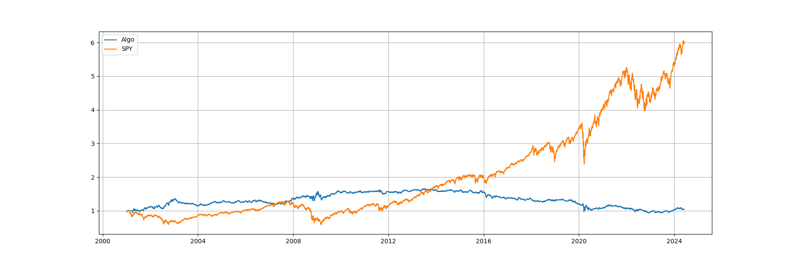

# Statistical Arbitrage in the US Equities Market 

A recreation of Avellanda and Lee's 2008 paper on statistical arbitrage. Fits an O-U model (more generally: a mean-reverting model) to the residuals of a regression onto certain factors. Paper uses PCA, both via a set # of PCs and a set % of variance explained, and ETF's to create the factors. My current implementation only uses a set # of PCs. 

To-do: 

1. Prompt GPT for function to calculate backtest metrics given return series

2. expand implementation to include %var explained and ETF's 

3. Implement better modularization (and a class structure?) 
    - instead of parsing eigenvectors explicitly at the start of the backtest function, do that elsewhere (etc)

4. Expand data to include more stocks. Original paper used 1417, I use all stocks which were in the S&P500 since 2000. 
    - Issue is that I have to wait (training window of PCA) # of days before each stock can be traded upon, which is problematic as stocks were added and deleted from the index
    - In practice, the number of tradable stocks starts at 349 and grows to 498 by the end. 

 
 

Backtest with 15 PCs and no costs

 

Backtest with 15 PCs and costs of 5bps/trade 

 

Backtest with 15 PCs and costs of 10bps/trade

